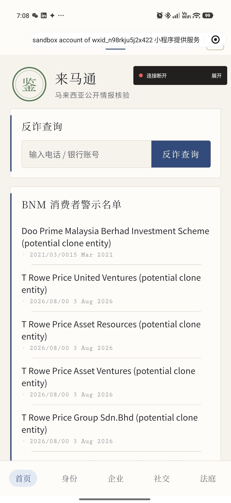
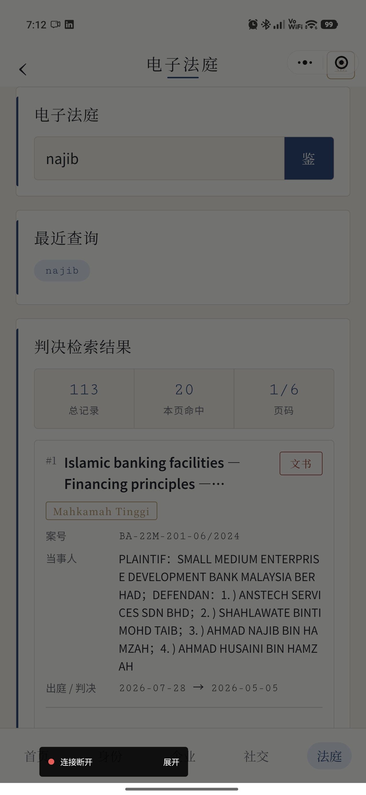
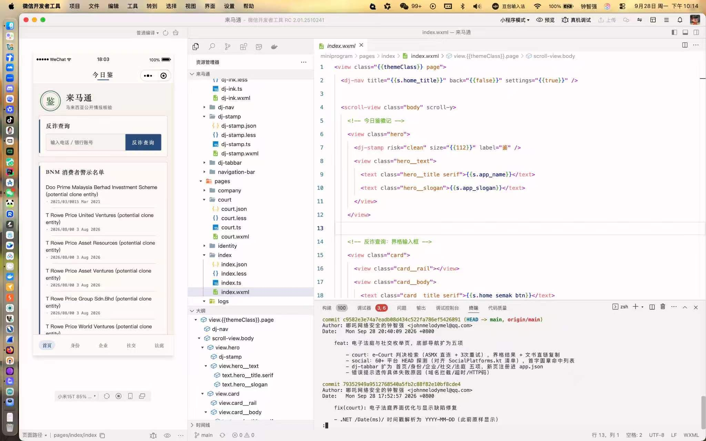

# 来马通 · MalaysiaOsintMiniProgram

[](https://www.typescriptlang.org) [](https://developers.weixin.qq.com/miniprogram/dev/framework/) [](https://github.com/ctkqiang/MalaysianOSINTAPP) [](https://github.com/ctkqiang/MalaysiaOsintMiniProgram/commits/main) [](https://github.com/ctkqiang/MalaysiaOsintMiniProgram/pulls)

**马来西亚开源情报工具箱 | Malaysian OSINT Toolkit**

_一个把 PDRM 反诈、移民局、反贪会、国家银行、电子法庭、黄页与 60+ 社交平台探测装进微信的小程序_

**来马通** 是 [MalaysianOSINTAPP](https://github.com/ctkqiang/MalaysianOSINTAPP)（Kotlin/Compose 原版）的微信小程序重制版：
接口层按原版 `OSINTRepository.kt` 1:1 移植，界面层换成本项目自创的「丹青鉴」设计语言——宣纸底色、
界格卡片、朱砂印章，查询结果像一页页卷宗。

适用于在马来西亚的反诈骗自查、背景了解、诉讼检索与开源情报整理等场景。所有查询直连
**政府公开接口**，无账号体系、不采集用户数据、结果只存本机。

_English README: see [issue](https://github.com/ctkqiang/MalaysiaOsintMiniProgram/issues) — 本仓库以中文为主_

<table cellspacing="16">
  <tr>
    <td align="center"><br/><b>首页 · 反诈与 BNM 名单</b></td>
    <td align="center"><br/><b>电子法庭 · 判决检索结果</b></td>
  </tr>
  <tr>
    <td align="center" colspan="2"><br/><b>开发工作区 · 组件树与实时预览</b></td>
  </tr>
</table>

---

## 目录

- [法律声明](#法律声明)
- [项目定位](#项目定位)
- [核心功能](#核心功能)
- [快速开始](#快速开始)
  - [环境要求](#环境要求)
  - [导入与直连调试](#导入与直连调试)
  - [真机调试](#真机调试)
- [双模式架构与后端契约](#双模式架构与后端契约)
- [技术架构](#技术架构)
- [安全与隐私设计](#安全与隐私设计)
- [丹青鉴主题系统](#丹青鉴主题系统)
- [开发指南](#开发指南)
- [实战场景](#实战场景)
- [常见问题](#常见问题)
- [贡献](#贡献)
- [安全策略](#安全策略)
- [许可证](#许可证)
- [支持](#支持)

---

## 法律声明

> **本项目仅聚合公开数据源，供个人自查与合法的信息整理使用。** **查询结果仅供参考，不构成法律、投资或其他专业意见。** **使用者须自行确保查询行为符合马来西亚当地法律法规，开发者不对使用行为负责。**

---

## 项目定位

来马通把马来西亚六个官方/公开数据源的查询工作流合并进一个小程序，出门在外掏出微信就能查，
不用开电脑、不用装 APK。

```
政府公开接口（PDRM / IMI / SPRM / BNM / Judiciary / YellowPages / 60+ 社交平台）
        ↓  wx.request（直连模式） / 自建代理（上线模式）
        ↓  自写轻量 HTML 解析 · /Date(ms)/ 折算 · MyKad 推导
        ↓
「丹青鉴」渲染层：界格卡片 · 风险印章 · 三语字库 · 宣纸/夜墨双主题
```

### 与其他方案的区别

| 能力 | 来马通（小程序） | 原版 Android | 官网逐个查 |
|------|----------------|-------------|-----------|
| 免安装即用 | 是（微信内） | 需装 APK | 是 |
| 六源合一入口 | 是 | 是 | 否（6+ 个网站） |
| 身份证三源并发核验 | 是（SSPI+通缉+SPRM） | 是 | 否 |
| 电子法庭判决检索+翻页 | 是 | 是 | 是 |
| 中/英/马来三语 | 是 | 部分 | 视站点 |
| 明暗双主题 | 是（宣纸/夜墨） | 否 | 否 |
| 查询历史本地留存 | 是 | 是 | 否 |
| BNM 新增警示推送 | 订阅消息（需后端） | 本地通知 | 无 |

---

## 核心功能

### 反诈查询（Semak Mule）

- 手机号 / 银行账号 / 公司注册号一键核验 PDRM 涉诈名单
- 命中明细界格表展示；结论只依据实际返回行数（`count` 字段不可信，见[常见问题](#常见问题)）

### 身份证综合查询（MyKad）

- 12 位身份证号本地推导出生日期与州属
- SSPI 移民局状态 + 全国通缉名单 + SPRM 反贪会名单**三源并发**，逐源落印
- 解析逻辑逐条对齐原版 Kotlin 的选择器与按行取字段规则

### 电子法庭（e-Judgment）

- 关键词检索判决库：案号、法院徽章、当事人角色配对、出庭/判决日期（`/Date(ms)/` 自动折算）
- 累加式翻页（每页 20 条），判决书直链一键复制
- 20s 超时 + 3 次重试，对齐原版对慢站点的处理

### 社交账号枚举

- 用户名 → 60+ 公开平台 HEAD 探测（清单对齐原版 `SocialPlatforms.kt`）
- 8 并发分批，命中平台首字圆章展示

### BNM 消费者警示名单

- 首页直拉国家银行官网名单表格，支持翻页与重试

### 设置

- 主题三档（宣纸/夜墨/随系统）、语言三档（中/英/马来）
- BNM 警示订阅消息开关（授权状态实时回显）、免责声明确认重置、后端接入状态

---

## 快速开始

### 环境要求

- 微信开发者工具（Stable 版即可，基础库 ≥ 2.20）
- Node.js（仅用于 `tsc` 编译校验，无运行时依赖）
- TypeScript 工程已内置（`tsconfig.json`，vendored 类型于 `typings/`）

### 导入与直连调试

1. 微信开发者工具 → 导入项目 → 选择本仓库根目录，AppID 用自己的测试号即可。
2. **必做**：详情 → 本地设置 → 勾选
   **「不校验合法域名、web-view（业务域名）、TLS 版本以及 HTTPS 证书」**。
   - `semakmule.rmp.gov.my` 的证书链缺中间证书（原版 Kotlin 用 trust-all 绕过，小程序不可绕过），
     此勾选可同时豁免证书校验。
3. 编译校验：

```bash
npx tsc --noEmit   # 应零报错
```

### 真机调试

1. 点「真机调试」扫码——**域名豁免开关随调试会话下发，改完设置须重新发起真机调试**。
2. 仅「预览」时需在手机端小程序菜单 → 开发调试打开豁免。
3. 语法红线：真机运行环境不做 ES6→ES5 降级，**源码禁止 `?.` 与 `??`**（会触发
   `SyntaxError: Unexpected token`），空值兜底一律 `||` 或显式判断。

---

## 双模式架构与后端契约

`miniprogram/utils/api.ts` 顶部一个开关决定全链路走向：

| 模式 | 条件 | 用途 |
|------|------|------|
| 直连模式（默认） | `BASE_URL = ''` | 开发调试：与原版 Android 完全一致，直接请求政府公开接口 |
| 代理模式 | `BASE_URL = 'https://你的备案域名'` | **正式发布必须**：合法域名白名单只收自有备案域名，政府 `.gov.my` 无法登记 |

代理后端契约（REST + JSON，转发逻辑照抄原版 Repository 即可）：

| 方法 | 路径 | 请求体 | 响应 |
|------|------|--------|------|
| POST | `/semakmule` | `{query}` | `{count, table_data: string[][]}` |
| GET | `/bnm?page=1` | — | `{count, entries: [{name,website,date}]}` |
| POST | `/identity` | `{ic}` | `{sspi:{statusCode}, wanted:[…], sprm:[…]}` |
| GET | `/company?q=ssmNo` | — | `{name,category,address,website}` |
| POST | `/ecourt` | `{search,currPage}` | `{totalRecord, items:[…]}` |
| POST | `/social` | `{username}` | `{hits:[{platform,url,username}]}` |
| POST | `/subscribe` | `{templateId,action,scenes}` | `{ok:true}` |

推送启用：微信公众平台「订阅消息」申请模板 → 模板 ID 填入 `utils/push.ts` 的 `BNM_TEMPLATE_ID`
→ 后端 watcher 轮询 BNM 新增条目时下发（`/subscribe` 上报的 `accept` 记录即订阅关系）。

---

## 技术架构

### 目录结构

```
MalaysiaOsintMiniProgram/
├── miniprogram/
│   ├── app.ts|json|less           # 入口：主题初始化、六页注册
│   ├── styles/
│   │   ├── theme.less             # 传统色 Token（宣纸/夜墨双主题）
│   │   └── shared.less            # 界格卡片/输入框/云纹空态
│   ├── components/
│   │   ├── dj-nav/                # 题字顶栏
│   │   ├── dj-stamp/              # 风险印章（命中朱砂/清白竹青/存疑泥金）
│   │   ├── dj-ink/                # 水墨加载
│   │   └── dj-tabbar/             # 五项底部导航（自绘，非原生 tabBar）
│   ├── pages/
│   │   ├── index/                 # 反诈查询 + BNM 名单 + 历史
│   │   ├── identity/              # 身份证三源核验
│   │   ├── company/               # 企业黄页查询
│   │   ├── social/                # 社交账号枚举
│   │   ├── court/                 # 电子法庭判决检索
│   │   └── settings/              # 主题/语言/推送/关于
│   └── utils/
│       ├── api.ts                 # 统一 API 层（直连/代理双模式）
│       ├── models.ts              # 数据模型
│       ├── parsers.ts             # MyKad 推导 / SSM 校验 / HTML 清洗
│       ├── i18n.ts                # 中/英/马来三语字库
│       ├── settings.ts            # 偏好持久化
│       ├── history.ts             # 本地查询历史（按类型限量）
│       └── push.ts                # 订阅消息申请/开关/上报
├── typings/                       # 微信 API 类型（vendored + modern 补充声明）
└── project.config.json            # TS + Less 编译插件配置
```

### 关键设计

- **零第三方运行时依赖**：HTML 解析为自写轻量实现（div 块提取、实体解码、按行取字段），
  替代原版 Jsoup；`package.json` 仅一个 devDependency（类型包）。
- **命中判定不信 `count`**：Semak Mule 对任意关键词返回递增的 `count` 而 `table_data` 为空——
  它是 DataTables 分页总数。判定只看实际行数；空返回显示「无法判定」而非「清白」。
- **e-Judgment 折算层**：`/Date(ms)/` → `YYYY-MM-DD`；案号内嵌 `(Mahkamah …)` 拆为法院徽章；
  `PLAINTIF`/`DEFENDAN` 角色行与人名行配对整理；全零 GUID 视为无文书，隐藏下载按钮。
- **订阅消息而非假推送**：小程序无自主推送能力，前端只负责授权与偏好上报，下发由后端完成，
  不伪造「推送成功」体验。

---

## 安全与隐私设计

| 措施 | 实现 |
|------|------|
| 数据来源 | 仅政府公开接口与公开平台，无第三方聚合服务 |
| 账号体系 | 无。不采集手机号/身份证，查询词仅存本机 `wx.storage` |
| 历史留存 | 本机存储，按类型限量滚动，设置页一键清空 |
| 传输 | 直连模式全程 https；代理模式要求备案 https 域名 |
| 推送 | 仅用户主动开启订阅并授权后，后端方可下发；授权状态实时回显 |
| 写操作 | 无。所有功能只读，不向任何数据源提交表单 |

---

## 丹青鉴主题系统

明暗两档 × 传统色 Token，语义色跨主题统一：

| 语义 | 宣纸（浅色） | 夜墨（深色） | 用途 |
|------|------------|------------|------|
| 底色 | 宣纸 `#F6F3EC` | 焦墨 | 页面背景 |
| 主色 | 黛青 | 月白 | 导航/标题/选中态 |
| 危险 | 朱砂 | 朱砂（提亮） | 命中风险印章 |
| 安全 | 竹青 | 竹青 | 清白结论 |
| 提示 | 泥金 | 泥金 | 存疑/徽章/待核验 |

- 主题跟随 `wx.onThemeChange` 与系统联动，「随系统」档下自动切换。
- 界面元素以「界格」为基本母题：卡片左侧竖线、输入框格线、印章式结论，模拟卷宗观感。

---

## 开发指南

### 技术栈

微信小程序原生框架（Skyline 渲染）、TypeScript（严格模式）、Less（Token 化主题）、
`miniprogram-api-typings`（vendored，含 `getWindowInfo`/`getAppBaseInfo` 补充声明）。

### 编译与校验

```bash
npx tsc --noEmit                          # 类型闸门，提交前必跑
grep -rn '?\.\|??' miniprogram --include="*.ts"   # 真机语法红线，应无输出
```

### 新增一个查询模块的动线

1. `utils/models.ts` 定义结果类型 → 2. `utils/api.ts` 加直连函数 + 代理分支 →
3. `pages/` 新建四件套（ts/json/wxml/less）→ 4. `app.json` 注册 + `dj-tabbar` 加项 →
5. `utils/i18n.ts` 三语各补一组 `xx_` 前缀文案 + 页面 `S_KEYS` 注册 → 6. 跑上面两条校验。

---

## 实战场景

### 场景 1：接到可疑来电

对方报一个"银行账号"——微信搜开来马通，粘贴、按「鉴」，3 秒出印章。

### 场景 2：合作前快速背调

拿到对方公司 SSM 注册号查黄页留档；有身份证号则跑一遍三源核验，看移民局状态与
通缉/反贪名单是否有记录。

### 场景 3：检索判例

律师助理在地铁上搜 `najib`，翻两页判决列表，把目标案号的文书链接复制给同事在电脑端下载。

---

## 常见问题

**Q: 真机上所有请求都失败，开发者工具却正常？**
A: 域名豁免不随代码走，随**调试会话**走。重新发起「真机调试」扫码；纯预览需手机端开开发调试。

**Q: 电子法庭提示"域名拦截"？**
A: 同上。若豁免已开仍失败，看提示后缀的具体原因（超时/HTTP 码）——判决网实测响应约 9s，
偶发超时会自动重试 3 次。

**Q: Semak Mule 返回 count 很大但表格是空的？**
A: 正常。`count` 是站点分页总数不是命中数（对乱码也返回大数字）。本工具只按实际行数判定，
空结果显示「无法判定」。

**Q: 上线后为什么必须自建代理？**
A: 微信只放行「服务器域名」白名单内的 https 域名，政府 `.gov.my` 域名无法登记为合法域名。
把 [后端契约](#双模式架构与后端契约) 的 7 个接口实现后填入 `BASE_URL` 即可无缝切换。

**Q: 推送开关提示"需先配置模板 ID"？**
A: 在微信公众平台申请订阅消息模板，ID 填入 `utils/push.ts`，并实现后端 `/subscribe` 与下发逻辑。

---

**如果这个工具帮到了你，请给它一个星标！**

**一屏卷宗，查遍马来公开数据**

---

## 贡献

欢迎提交 Issue 与 Pull Request。动手前请读：

- 本 README 的[丹青鉴主题系统](#丹青鉴主题系统)与[技术架构](#技术架构) —— 设计语言定义与动线约定

约定：

| 项目 | 要求 |
|------|------|
| 语法 | 源码禁用 `?.` / `??`（真机不降级），ES2018 内 |
| 类型 | `npx tsc --noEmit` 零报错才可提交 |
| 文案 | 任何新增界面文案必须**三语齐补**（中/英/马来），并注册进页面 `S_KEYS` |
| 提交信息 | Conventional Commits；scope 限 `api` / `ui` / `pages` / `i18n` / `docs` / `build` |
| 提交粒度 | 一个逻辑改动一个提交，格式化与行为改动分开 |
| 禁止 | 不要提交 `project.private.config.json`、构建产物或任何 AppID 私有配置 |

---

## 安全策略

本工具的行为边界是**只读公开数据**：

- 不向任何数据源提交表单、不注册账号、不绕过验证码机制；
- 直连频率受单次查询触发约束，请勿脚本化批量轮询政府接口；
- 查询历史仅存本机 `wx.storage`，清除小程序数据即彻底消失。

发现安全问题请**不要开公开 Issue**，直接邮件联系 `johnmelodymel@qq.com`，或在 GitHub 的
Security → Report a vulnerability 私下提交。请附复现步骤与影响范围。

---

## 许可证

本仓库当前**未声明开源许可证**（原版 MalaysianOSINTAPP 亦无 LICENSE 文件）。
在补齐许可证之前，默认保留所有权利；如需引用本仓库代码，请先开 Issue 联系作者。

各数据源的接口与内容版权归其官方所有：PDRM（Semak Mule）、Royal Malaysia Police、
Jabatan Imigresen Malaysia（SSPI）、SPRM、Bank Negara Malaysia、Judiciary Malaysia。

---

<div align="center">

<h2>支持</h2>

<p>如果您觉得本项目对您有帮助，欢迎 Star / Fork，也欢迎请我喝杯咖啡</p>
<p><sub>您的支持是我持续维护和改进的动力</sub></p>

<br/>

<strong>微信扫码捐赠</strong><br/><br/>


<br/>
<br/>

</div>

---

基于 TypeScript 构建 · 丹青鉴设计语言 · 直连政府公开接口 · ctkqiang
